<p align="center" style="padding-bottom:-10px">
        
</p>

<div align="center">


</div>

---

## Table of Contents

[Description](#description)

[Installation and Compilation](#installation-and-compilation )

[Usage](#usage)

[Use Case](#use-case)

## Description

This is token distribution smart contract design pattern proof of concept named as Distro, where by interlinking `spending` contract with `minting` contract we have achieved greater use case for smart contracts manly minting contract interaction inside transaction, where minting contract now can have access to input UTxO Datum.

There are different approaches to make a concept called "Shared Validation" possible, which means several contracts with their unique validation will create set of validations and together validate the whole transaction. At here by using `txInfoRedeemer` and "inline datum" we've tried to achieve shared validation.

In the case of two smart contracts namely **Distro** and **Regulator**, distro contract is the spending contract and regulator contract is the minting contract which will validate minting of "HAPPY_TOKEN".

The scenarios of PoC is about two developers use these two contracts to mint the their share of project tokenomic in two different phases. So after deciding their share, the total amount of project tokenomic and when they  are allowed to min, they'll put all those information into **inline datum** and attached it to the UTxO that is going to be send to Distro contract, so when the time of minting comes, Regulator(`minting`) contract by help of Distro(`spending`) will use inline datum of input UTxO to validate all the minting conditions and cases.

<p align="center" style="padding:-10px">
        
</p>

1. The Regulator smart contract aims to handle the following:

    1.1. Minting genesis token, which will be sent to Distro contract with inline datum and specify how, when and who is able to mint "HAPPY_TOKEN".
      - Genesis token roles is to proof authenticity of the UTXO that its inline datum is going to be used as reference for minting.

    1.2. All the information that going to be inside inline datum will be contract parameter of Regulator contract, and inside contract, the validator will check all the inline datum fields authenticity and integrity against those parameters.

    1.3. Checks whether first or second developer has signed the Tx or not.
      - Since there are different versions same contract for educational purposes, in one version both Regulator and Distro are going to check that, but one is enough in the scenario of this design pattern.
  
2. The Distro smart contract aims to handle the following:

    2.1. By accessing to Regulator contract redeemer, handle different cases of developer claiming tokens on each phases.

    2.3 By using information stored as inline datum of input UTxO that must holds genesis token, the contract will validate the minting process.

    2.3 Update inline datum based on the action developer has done.

---

## Installation and Compilation  

1. Checkout `plutus-apps` repo to `v1.0.0` tag.
2. Run `cabal update` then `cabal repl`
3. Call `writeScript` function to compile Distro contract
4. load `Regulator.Compiler` then call `writScript` again to compile Regulator contract
5. Take the script hash from the result and substitute Happy token currency symbol variable at `Regulator.ToJSON` file.
6. load `Regulator.ToJSON` and call `main` function to create Datum and Redeemer files for Regulator.
7. load `Distro.ToJSON` and call `main` function to create Datum and Redeemer for Distro Contract.

---

## Usage

In order to run the scenario:

1. Make all script inside `./utils/scripts` folder executable.

2. Create `wallets` folder inside `utils` folder and add `protocol.json` file to it.

    ```bash
    cd ./utils; mkdir wallets; cd ./wallets
    ```

3. Create following wallets folders inside `wallets` folder and use the folder name as wallet name by using `createWallet.sh` script and then fund them.
    2.1 `collateral` which will be used for collateral inside transactions.
    2.2 `contract_reference` which will be used for contract reference UTxO for both Distro and Regulator contracts.
    2.3 `first_dev` which be used as First developer wallet to mint Happy token.
    2.4 `second_dev` which be used as Second developer wallet to mint Happy token.
    2.5 `debugger` which will be used for debugging purpose.
4. Change values of variables at both `Regulator.ToJSON` and `Distro.ToJSON` based on the wallets, time and date of minting and the amount each developer will mint.
5. After contracts compilation, and creating Datum and redeemer check `env.conf` file environment variable at `scripts` folder and set them based on your system configuration.
6. Run `createDistroContractRefUTxO.sh`
7. Wait for a minute then run `createRegulatorContractRefUTxO.sh`
8. Run `genesisMint.sh`
9. Run `firstDevClaimAtPhaseOne.sh`
10. Based on the time you have set for the scenario run `firstDevClaimAtPhaseTwo.sh`, You can run this script without running first phase too, to see mint total phases at once.

---

## Use Case

This PoC was done in both Typed and Untyped validation for demonstrating different cost and issues of executing this design pattern. But with correct optimization and compilation, this PoC is effective and possible to implement within a Dapp.

Beside the usage described already, an NFT project can use this PoC and design pattern to allow its user mint NFT safely without the need for the project minting by themselves and then sending to users. The minting process would be an internal transfer, therefore fee and cost for minting will be reduced.

---

## Collaboration & Acknowledgment

Gimbalabs, Ekival, James, Genty, Adrian

---
